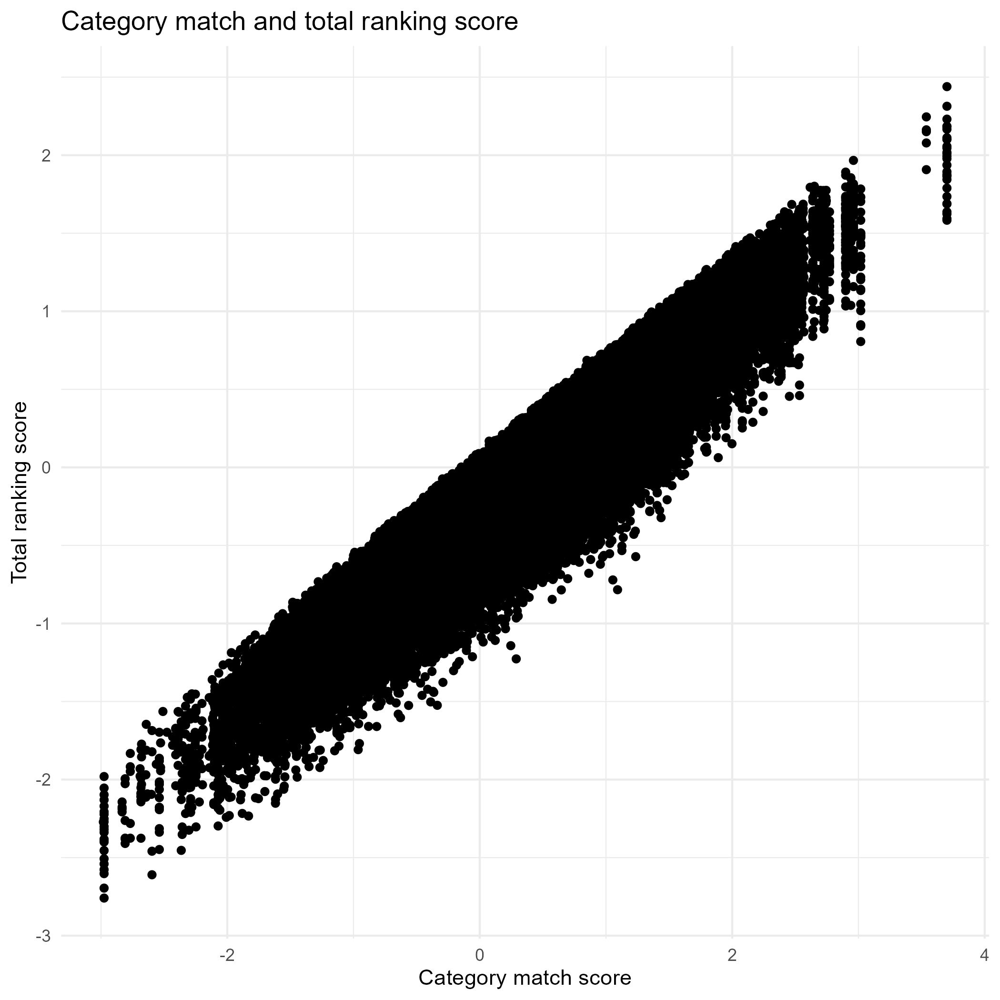
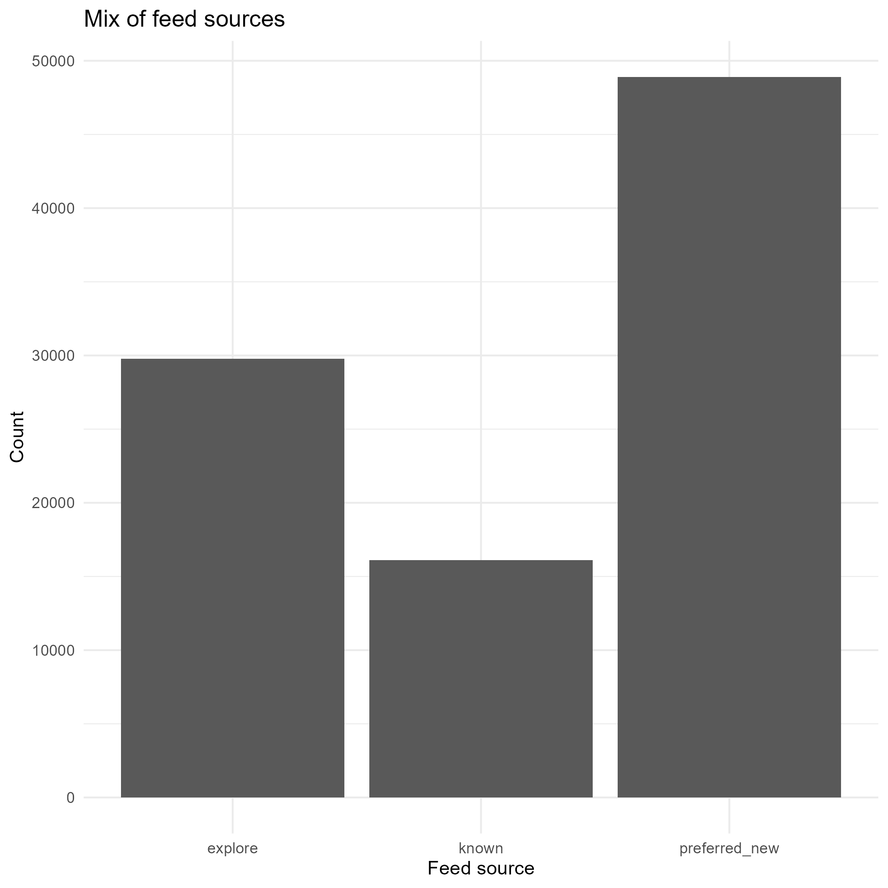

--- 
title: "TikTok Final Report" 

format: pdf execute: 
echo: false 
warning: false 
--- 


# Data Inspection 
```{r}
count_rows <- nrow(views)
print(count_rows)
str(views)
head(views)
summary(views)
colSums(is.na(views))
```
The data inspection was first used to get an overview of the dataset. We checked the number of observations, the variables, the structure of the data, and the number of missing values.


# Summary Analyses 
```{r}
{width=85%}
```
The figure shows a clear positive relationship between the category match score and the total ranking score. Observations with a higher category match score generally also have a higher total ranking score.


## Impressions 
```{r}
{width=85%}
```
The figure shows how the impressions are divided across the different feed sources. `preferred_new` occurs most often, followed by `explore` and `known`. This gives more information about where the impressions in the dataset come from.


## Sessions 
```{r}
{width=85%}
```
Most TikTok sessions are relatively short. As the session duration becomes longer, the number of sessions decreases. Only a small number of sessions have a long duration.


## Watch Events 
```{r}
{width=85%}
```

The figure shows that longer sessions generally contain more viewed videos. Users with short sessions watch only a few videos, while the number of viewed videos increases when the session becomes longer.


# Regression Analysis 
```{r}
{width=85%}
```

Distribution of how often each action occurs.
The four actions occur in relatively similar numbers. `exit_platform` and `watch_full` occur slightly more often, while `skip_after_partial` and `skip_immediate` occur slightly less often.


```{r}
{width=85%}
```

The mean watch time differs clearly between the actions. Videos that are watched fully have the highest average watch time. The average watch time is lower when users skip a video after watching part of it or leave the platform. An immediate skip has almost no watch time.


```{r}
{width=85%}
```

The number of watches changes from day to day. However, the figure also shows an overall increase towards the end of the observed period. The number of daily watches is generally higher in September than at the beginning of August.


# Conclusion